# Daisy 安装指导书

[TOC]

## 1 引言

### 1.1	编写目的

本文档从Daisy的基本概念入手旨在介绍Daisy部署的基本配置和用法，结合组网图介绍部署过程中参数配置和界面使用。

### 1.2	术语和缩略语

|服务	|项目名称	|功能描述|
|----|:----:|:----|
|Daisy|Daisy|TECS的自动化部署工具|
|Dashboard|	Dashboard|Web界面，用户通过Dashboard能够进行界面化的daisy部署|
|Identity Service|	Keystone	|向服务提供认证和鉴权功能|
|Ironic|	Ironic|	Ironic是OpenStack提供裸金属部署的解决方案,而非虚拟机。默认情况下,它将使用PXE和IPMI接口管理主机,但Ironic还支持特定供应商的插件可以实现额外的功能|
|TECS	|	Tulip Elastic Computer System	|郁金香弹性计算系统|
|IPMI|	Intelligent Platform Management Interface|	智能平台管理接口 (IPMI)是一种开放标准的硬件管理接口规格，定义了嵌入式管理子系统进行通信的特定方法|
|BMC|	Board Management Controller	|单板管理模块|

### 1.3	支持IPMI服务器列表

Daisy部署的服务器需要支持IPMI协议，现有硬件服务器中支持IPMI的服务器类型有：

E9000，HPC7000，DELL，RS4300，I8350等。

##2	组网规划

###2.1	组网说明

本次安装组网采用2个控制节点（HA+LB）+2个计算节点（compute）+1个KS3200 IPSAN。

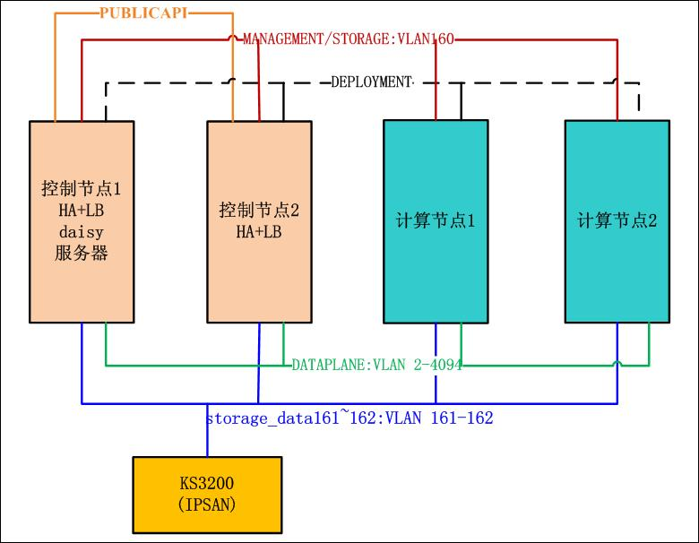

###2.2	硬件说明

|服务器类型|	数量  |	用途|
|----| :----: |:----|
|E9000刀片 | 	4	|2块控制节点（其中一块含 安装daisy服务器）2块计算节点|
|KS3200 IPSAN   |	1   	|IPSAN，作为TECS的存储后端|

###2.3	网络规划

本场景为典型的Daisy部署TECS环境场景， 规划了管理平面（MANAGEMENT），public平面（PUBLICAPI），存储管理平面（STORAGE），存储业务面（storage_data）以及虚拟机业务平面（DATAPLANE）；其中管理平面（MANAGEMENT）与存储管理平面（STORAGE）合一。

注：实际物理服务器上还有PXE部署平面（DEPLOYMENT），用于主机发现和安装其他节点操作系统，但网络映射不需要关注，所以该平面不列在下面列表中。

E9000刀片包含4个网口，网口与平面的映射关系如下：

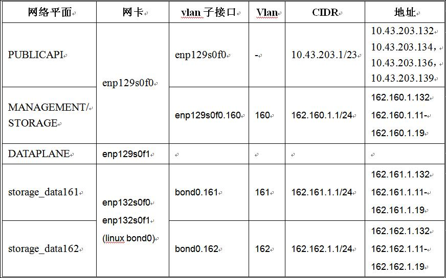

Daisy所在服务器的地址需要手工配置，网络规划如下：

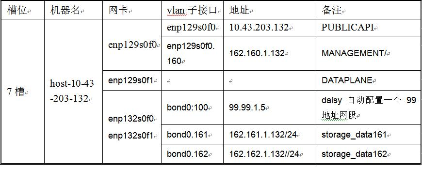

##3	Daisy安装和说明

###3.1	OS+DAISY+TECS版本说明

整套环境安装需要取用3个版本，OS+DAISY+TECS版本，本例的daisy服务器运行在docker中，所以daisy安装时需要取用带docker的操作系统。

|系统	|	版本|
|----|:----|
|OS|Mimosa-V02.16.11.P7B1I59-CGSL_VPLAT-5.1-x86_64-KVM-director003-daisy117.iso
|DAISY|	daisy-2016.2.11-7.11.119.el7.x86_64.rpm|
|TECS|	ZXTECS_V02.16.11_P7B1_I156.zip|

###3.2	第一台裸机（Daisy服务器）的操作系统安装

第一台裸机（后续做daisy服务器使用）的操作系统需要用U盘进行安装（U盘制作方法见５.１附件1  U盘的制作方法）

#### 3.2.1服务器BMC地址设置

通过登录系统管理单板（SMM）的web页面设置对应服务器的BMC地址。

以E9000为例，SMM的初始登录地址，左板：192.168.5.7，右板：192.168.5.8。如需要修改IP，可以通过使用网线连接PC与SMM上的网口，登录SMM的地址，例如：https://192.168.5.7，用户名：zteroot，密码：superuser。

   选中导航条中的【机框管理】页面，在左侧导航树中选【机框配置】-【网络配置】，可以修改SMM和刀片的BMC IP，子网掩码和网关。

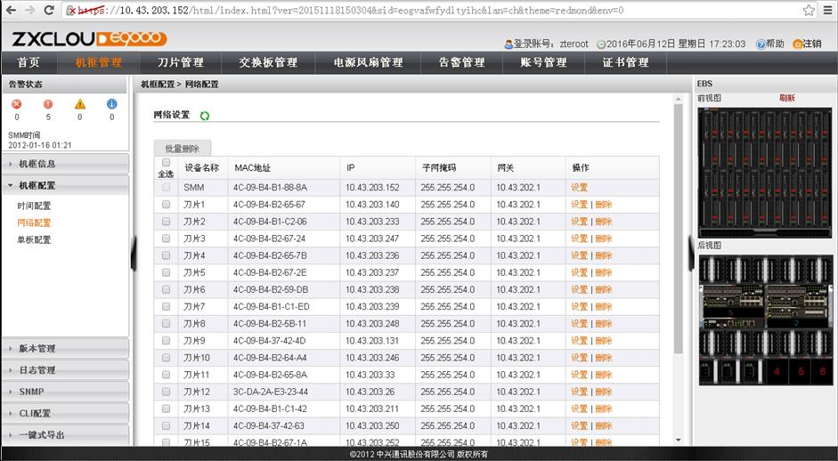

注：

1）	SMM设置的地址必须物理可通，否则修改后无法登录。

2）	刀片的BMC地址必须与SMM设置的地址在同一网段，否则BMC地址不通。

如果使用Daisy服务器安装部署目标刀片，必须确保Daisy服务器所在刀片与目标刀片的BMC地址物理可通。

#### 3.2.2安装TFG操作系统

本章描述如何安装第一台服务器的TFG操作系统。

准备工作：

1.	调试机与刀片smm管理模块网络互通，通过kvm链接

2.	要安装的刀片上电

3.	服务器安装做好raid

4.	将U盘接入待安装的第一台服务器7槽

注：所有服务器安装操作系统之前都要先设置好raid。服务器设置好RAID之后，后续如果没有修改需要无需再重复做RAID。

#####3.2.2.1刀片启动模式修改

配置前提，SMM单板已经配置好，并且可以登陆，如下图：

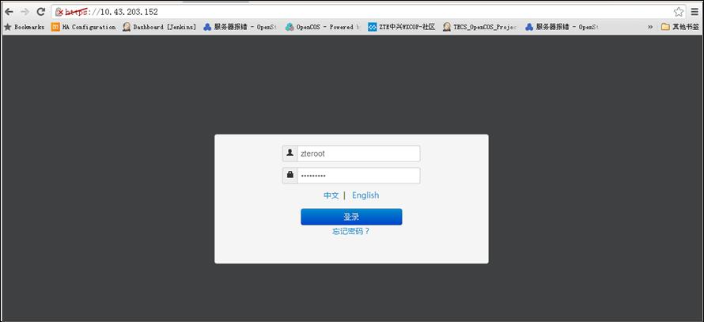

输入用户名和密码，默认为zteroot/superuser，登陆：

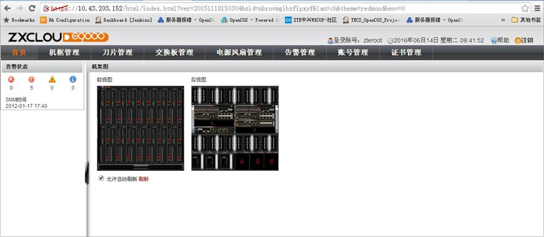

点击【机框管理】，左侧的【机框配置】-【单板配置】，在右边界面中，选中第一块服务器所在的7槽刀片，点击【设置】，配置为USB启动。

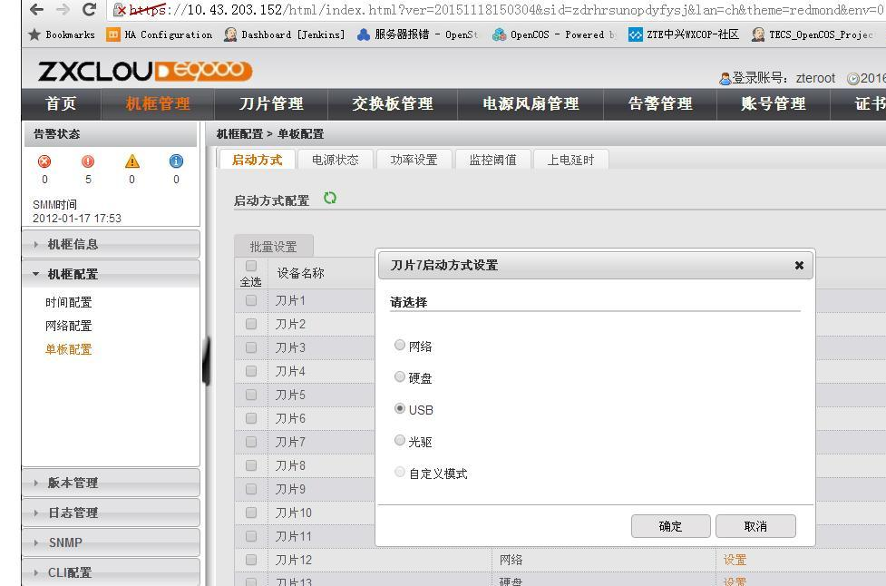

#####3.2.2.2 通过BMC地址登录服务器KVM

【机框管理】，左侧的【机框配置】-【网络配置】，查看该服务器的BMC地址为10.43.203.239。通过该地址（https://10.43.203.239/，默认用户名与密码为zteroot/superuser）登录该服务器的KVM观察服务器重启及操作系统安装过程。

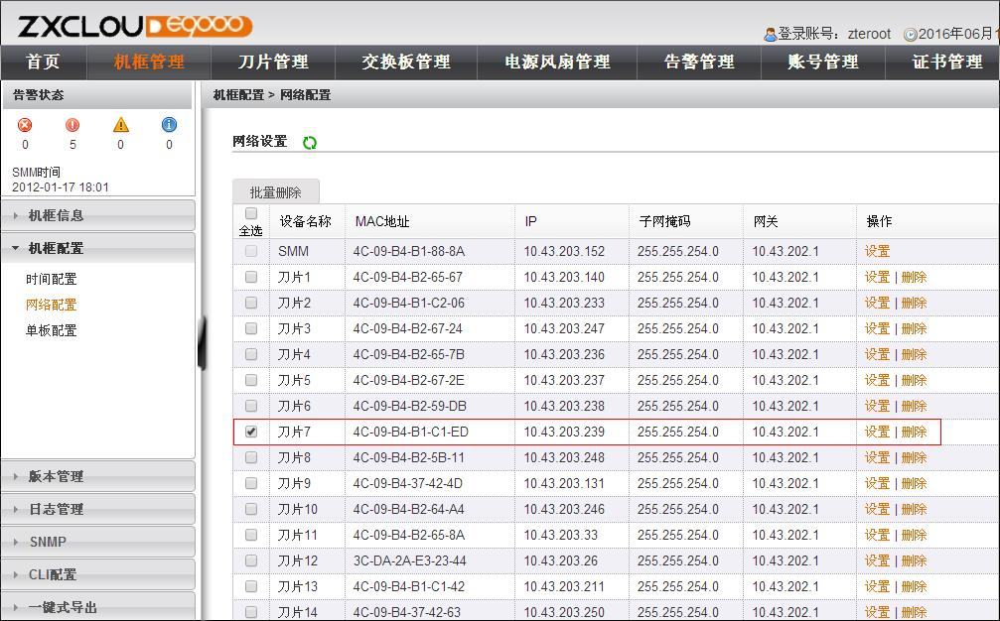

#####3.2.2.3 操作系统安装

将U盘插在第一块服务器上，重启该服务器，通过服务器KVM可看观察到安装过程.

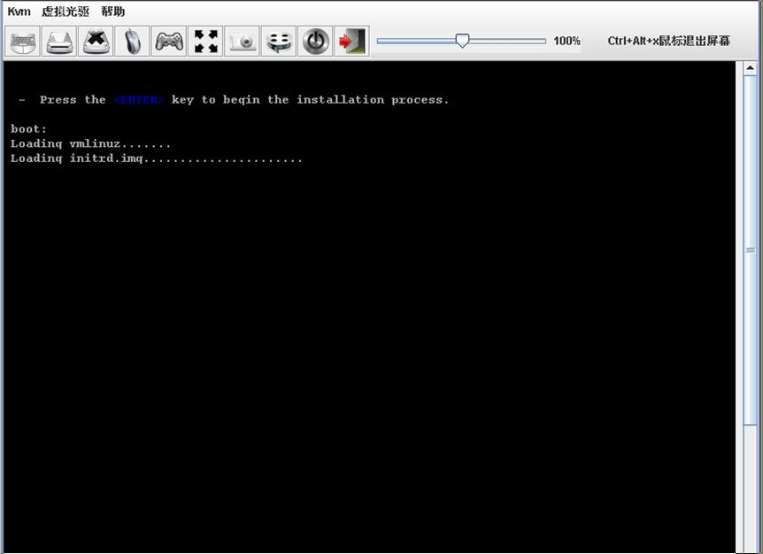

安装完成后会提示退出重启。

注意：系统重启前可以先更改该刀片的启动方式为硬盘启动，并拔出U盘然后再重启刀片。

####3.2.4操作系统设置

操作系统涉及的主机名、IP地址、网卡规划请参照规划说明。

本节操作所有控制节点和计算节点都需要执行，只是第一台daisy服务需要手动配置主机名和IP地址，其他节点和计算节点daisy安装时会自动进行配置。

#####3.2.4.1 地址规划

此Daisy所在服务器的地址规划见2.3网络规划。

1、第一台服务器需要手工配置，其他服务器通过Daisy中的网络平面配置会自动分配。

2、STORAGE存储控制面地址与MANAGEMENT合一。

#####3.2.4.2 主机名设置

[root@localhost]# **vi /etc/hostname**

==host-10-43-203-132==

[root@localhost]# **hostnamectl set-hostname host-10-43-203-132**

[root@localhost]# logout

	logout之后重新登录.

#####3.2.4.3 网口配置

1、enp132s0f0、enp132s0f1网卡做绑定，绑定口名称为bond0,并分别配置VLAN为161,162的子接口bond0.161，bond0.162；

修改/etc/sysconfig/network-scripts目录下ifcfg-enp132s0f0、ifcfg-enp132s0f1文件，多余的配置删除。。

[root@host-10-43-203-132 network-scripts]# **cat ifcfg-enp132s0f0**

TYPE=Ethernet

BOOTPROTO=static

NAME=enp132s0f0

DEVICE="enp132s0f0"

ONBOOT="yes"

MASTER=bond0

SLAVE=yes

[root@host-10-43-203-132 network-scripts]# **cat ifcfg-enp132s0f1**

TYPE=Ethernet

BOOTPROTO=static

NAME=enp132s0f1

DEVICE="enp132s0f1"

ONBOOT="yes"

MASTER=bond0

SLAVE=yes

[root@host-10-43-203-132 network-scripts]# **cat ifcfg-bond0**

BOOTPROTO="static"

ONBOOT="yes"

DEVICE="bond0"

BONDING_OPTS="miimon=100 mode=1"

[root@host-10-43-203-132 network-scripts]#

[root@host-10-43-203-132 network-scripts]# **cat ifcfg-bond0.161**

OTPROTO="static"

ONBOOT="yes"

DEVICE="bond0.161"

IPADDR="162.161.1.132

NETMASK="255.255.255.0"

VLAN=yes

[root@host-10-43-203-132 network-scripts]# **cat ifcfg-bond0.162**

OTPROTO="static"

ONBOOT="yes"

DEVICE="bond0.162"

IPADDR="162.162.1.132"

NETMASK="255.255.255.0"

VLAN=yes

[root@host-10-43-203-132 network-scripts]#

2、enp129s0f0网口上配置地址和VLAN160接口

在服务器上执行ip link add link enp129s0f0 name enp129s0f0.160 type vlan id 160命令增加VLAN160子接口，然后修改以下配置文件。

[root@host-10-43-203-132 network-scripts]# **ip link add link enp129s0f0 name enp129s0f0.160 type vlan id 160**

[root@host-10-43-203-132 network-scripts]# **cat ifcfg-enp129s0f0**

HWADDR=4C:09:B4:B1:C1:F0

TYPE=Ethernet

BOOTPROTO=static

NAME=enp129s0f0

UUID=56ae2b62-8826-4c11-9a89-290e7ca67071

DEVICE="enp129s0f0"

ONBOOT="yes"

IPADDR=10.43.203.132

NETMASK=255.255.254.0

GATEWAY=10.43.202.1

 [root@host-10-43-203-132 network-scripts]# **cat ifcfg-enp129s0f0.160**

OTPROTO="static"

ONBOOT="yes"

DEVICE="enp129s0f0.160"

IPADDR="162.160.1.132"

NETMASK="255.255.255.0"

VLAN=yes

本例中已经设置大网网关10.43.202.1，如果没有设置网关，需要设置一下网关,否则安装TECS会失败；

设置网关后执行service network restart生效配置，重启之后network服务正常，ifconfig查看配置的地址均已生效。

###3.3	运行在Docker中的daisy安装

执行：daisy_docker_init.sh input1 input2 input3 input4 input5 input6 来起daisy和vdirector容器

入参的含义：

input1 ：daisy里面dhcp的网口

input2 ：daisy管理面ip

input3 ：ICT绑定的地址

input4 ：director的nginx对外暴露的IP，用来替换endpoints中的openstackIP（director提供给nfvo访问的ip地址--------nfvo访问vim用）

input5 ： nvfo的IP，VIM主动nvfo上报PM数据用的

input6 :  nvfo的端口，VIM主动nvfo上报PM数据用的

    本文中只起daisy容器，所以只需填写input1 input2参数即可。 根据前面规划，bond0为daisy里面dhcp的网口，10.43.203.132为daisy管理口IP。

[root@host-10-43-203-132 home]# **daisy_docker_init.sh bond0 10.43.203.132**

daisy docker config file: /var/lib/daisy/scripts/daisy.conf

ln -s '/usr/lib/systemd/system/nfs-server.service' '/etc/systemd/system/nfs.target.wants/nfs-server.service'

rsyslogd restart!

vdirector config file not exist!

creating daisy ...

daisy-mysql

daisy-mysql.backup

WARNING: IPv4 forwarding is disabled. Networking will not work.

ccda0709026a7a185f6cf9e28bae39436144d8dafc60684eb79d591572fbba4f

VOL_pLP3o

WARNING: IPv4 forwarding is disabled. Networking will not work.

"daisy" created

[root@host-10-43-203-132 home]# **docker-manage ps**

CONTAINER ID        IMAGE               COMMAND                CREATED             STATUS              PORTS               NAMES

==afa9b42d4736        937cb3bd58a4        "/bin/sh -c /bin/sh"   8 seconds ago       Up 7 seconds                            daisy==

docker-manage ps命令查看有如上高亮部分信息时，表示daisy容器已运行。

使用docker-manage enter daisy命令进行daisy容器设置hosts。

[root@host-10-43-203-132 home]# **docker-manage enter daisy**

-bash-4.2#**cat /etc/hosts**

127.0.0.1   localhost localhost.localdomain localhost4 localhost4.localdomain4

::1         localhost localhost.localdomain localhost6 localhost6.localdomain6

==10.43.203.132 localhost==

###3.4	登陆daisy的web页面

Daisy容器创建后稍等2分钟，等待daisy相关服务正常运行后，即可进入daisy的dashboard页面，即http://10.43.203.132:18080/ （具体ip就是在起daisy的时候输入的ip地址，端口号为18080），默认帐户admin/keystone

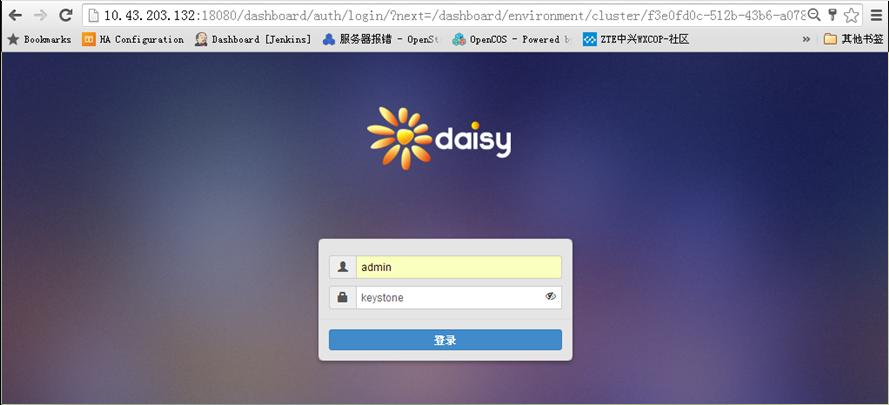

至此daisy服务器安装完毕，如需部署TECS主机，则可以参考下一章 4 集群部署

##4	DAISY独立部署TECS示例

###4.1版本上传

登录daisy DASHBOARD界面，进入【版本】页面，点击【选择文件】分别上传OS和TECS版本。

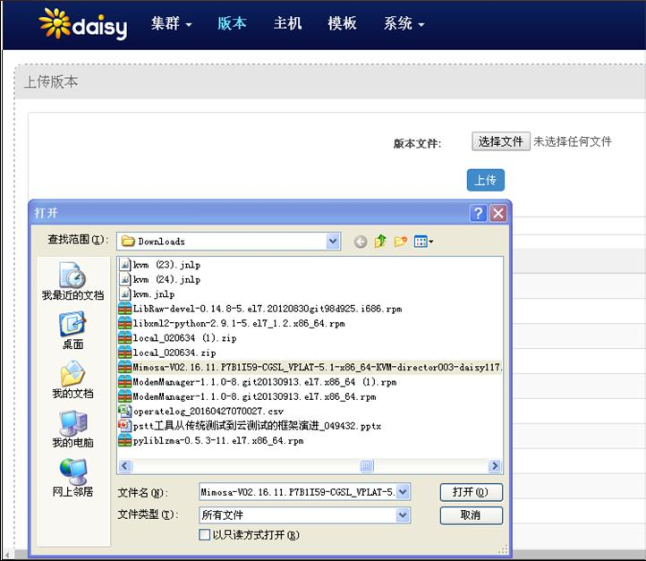

上传完成之后，可以显示ISO与bin文件.

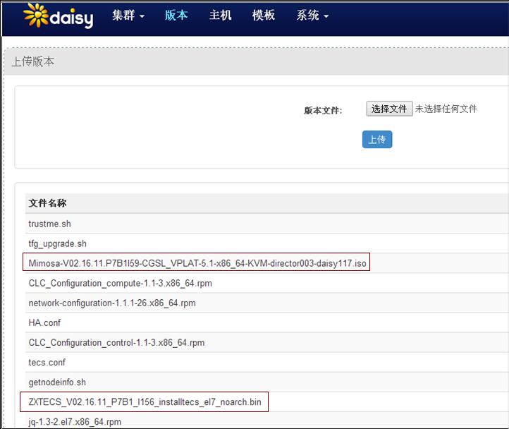

###4.2创建集群

登录daisy DASHBOARD界面进入【集群】列表，第一次登录时集群是空的，点击蓝色部分即可进行集群创建.

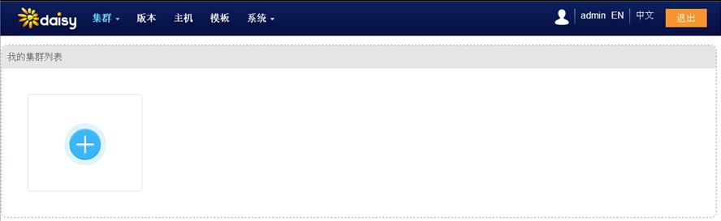

####4.2.1基本信息

集群创建时，先需要配置基本信息，在基本信息中填写集群名称，是否启用DNS以及描述信息，描述信息可以不填。

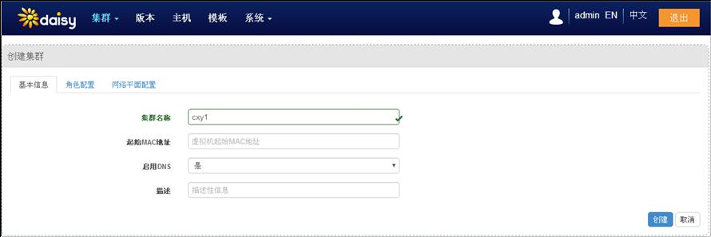

####4.2.2角色配置

1、控制节点HA配置

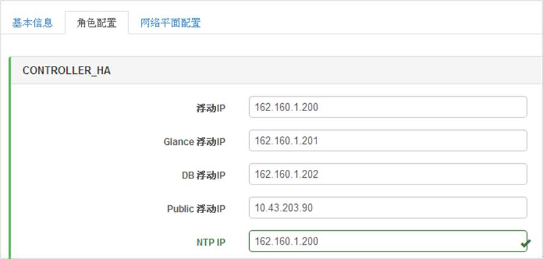

Public浮动IP需要与Public平面在同一网段，其他浮动IP需要与管理平面在同一网段，浮动IP可以手动配置，也可以选择自动分配，如果自动分配，网络平面的地址池中需要多分配4个IP地址用于分配各浮动IP地址。

NTP IP需要填专有时钟服务器地址，如果没有，可以填HA浮动IP地址

2、glance/DB/DBBackup/MongoDB后端类型配置

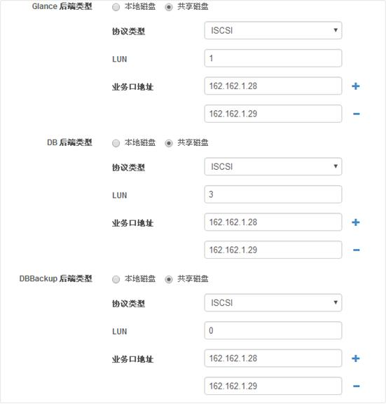

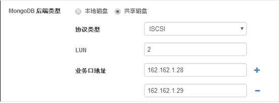

3、cinder后端类型配置

根据组网要求KS3200 IPSAN磁阵做为cinder后端，cinder点击新增一条后端配置

新增后端配置

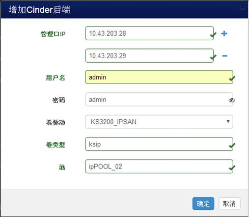 

按确定后即可增加一条cinder后端配置。

  

4、LB浮动IP配置

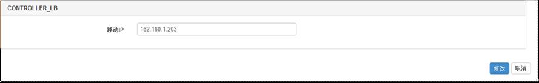

####4.2.3网络平面配置

参见２.３网络规划

说明：本组网中MANAGEMENT与STORAGE平面合一。

根据组网图做如下配置：

1、MANAGEMENT网络平面配置

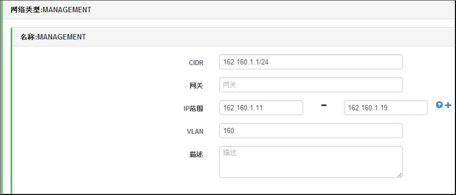

2、PUBLICAPI网络平面配置

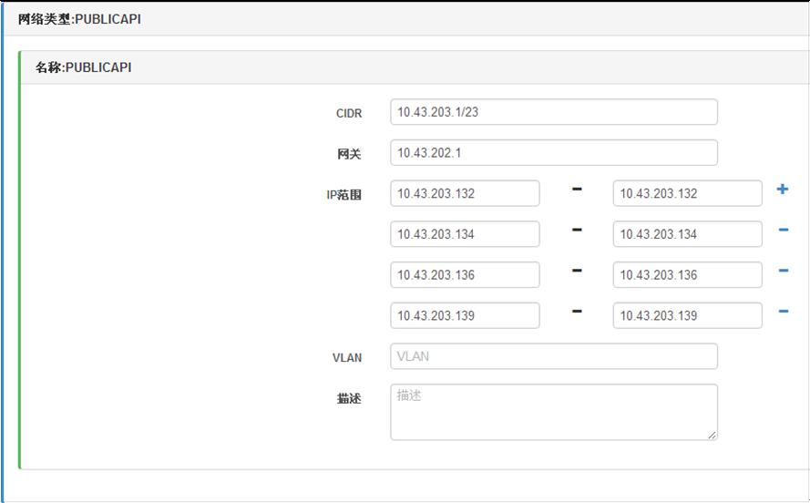

3、DATAPLANE网络平面配置

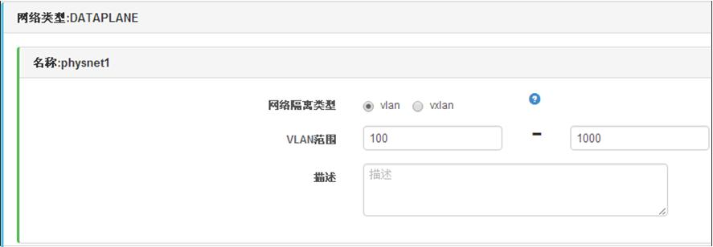

4、STORAGE网络平面配置

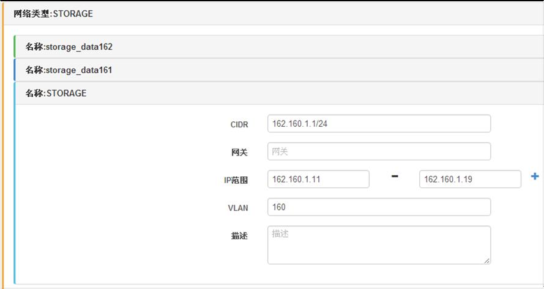

storage增加两个存储业务面网络配置

点击增加网络平面按钮

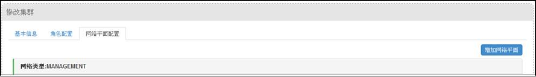

分别增加storage_data161, storage_data162网络平面配置(此处只截图161的配置过程)

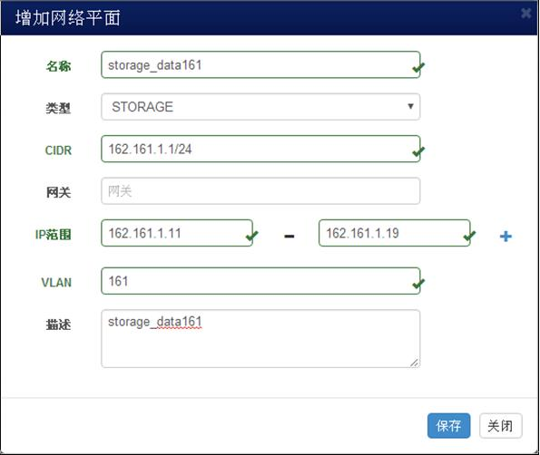

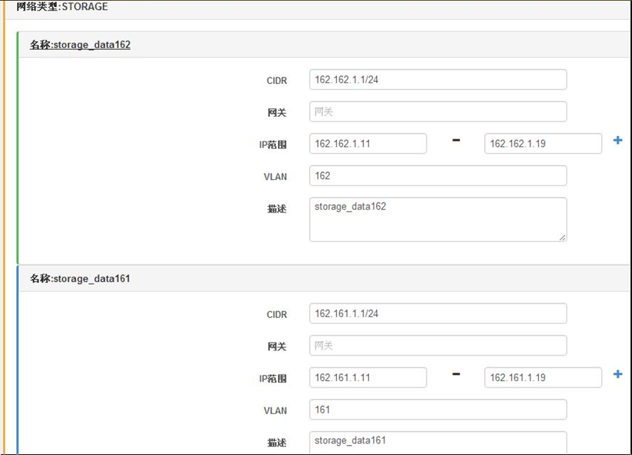

配置完成之后按右下角创建按钮即可进行集群创建，集群创建成功之后自动跳转到集群主机部署页面进行添加主机。

###4.3 集群主机部署

####4.3.1 主机发现

主机发现有两种方式：
一种是对操作系统已经安装成功的服务器通过SSH方式发现，如此处daisy所在的服务器，因为操作系统已经安装好，只需要安装TECS，可以通过SSH方式发现；
还有一种是PXE方式发现。

#####4.3.1.1 SSH发现宿主机

登录daisy集群页面，创建一个集群cxy1，然后进入集群cxy1，点击集群主机部署，即可开始发现主机操作。

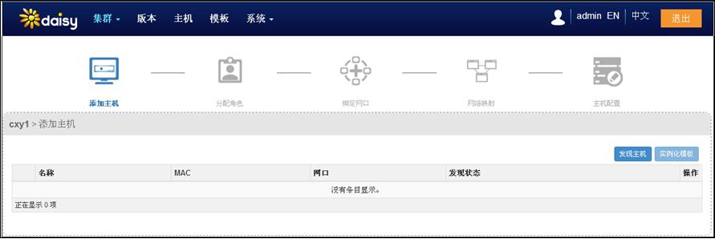

点击发现主机，然后逐一输入物理目标主机的SSH访问地址10.43.203.132，用户名和密码（默认是root/ossdbg1），点击提交后右侧即可显示待SSH发现的主机列表

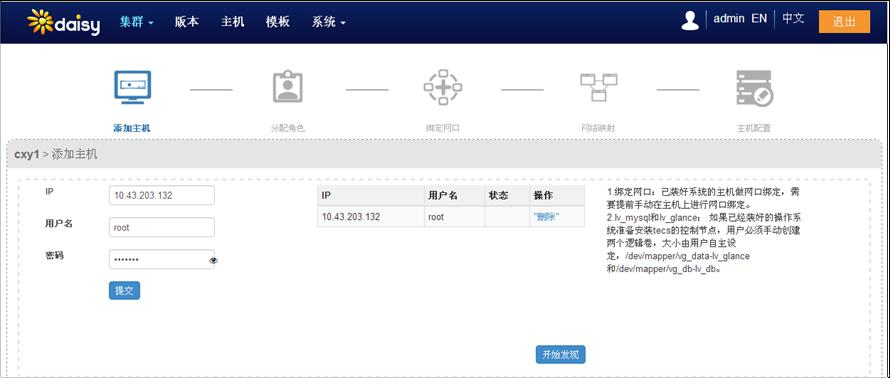

点击开始发现，发现成功之后主机列表可以显示SSH发现的主机。

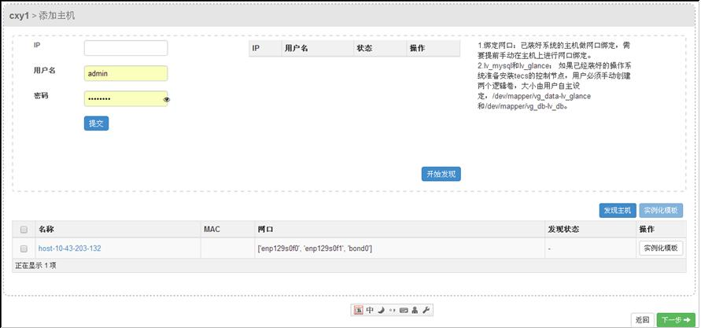

#####4.3.1.2 PXE方式发现其他主机

PXE发现首先要保证主机的PXE网络是通的，在daisy服务器上用ipmiping命令检查各主机的IPMI是否是通的。
主机的IPMI地址参考3.2.1节中BMC IP地址的信息。
[root@host-10-43-203-132 home]# **ipmiping 10.43.203.236**
ipmiping 10.43.203.236 (10.43.203.236)
*response received from 10.43.203.236: rq_seq=44*

登录SMM，将所有待安装系统的服务器设置为PXE（网络）启动，如下图 3、4、12槽为待PXE发现的主机，点“操作”中的设置，分别将其设置为网络启动。

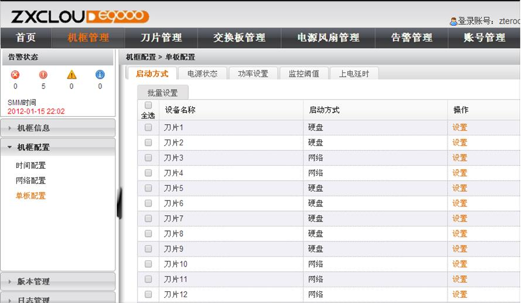

通过单板IPMI地址分别登录其KVM查看系统启动情况，如3槽IPMI地址为10.43.203.247，

则登录https://10.43.203.247，用户名/密码默认为zteroot/superuser; 在 设备操作---单板操作 中对服务器设置重启，然后点击单板操作旁边的 设置 按钮，按确定后服务器即可重启。

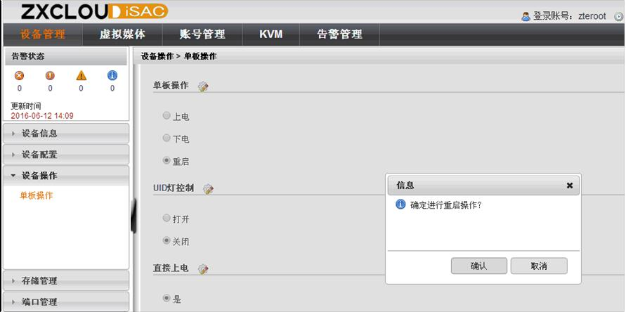

登录服务器的KVM，查看其能正常重启，且通过DHCP网口正确获取到小系统，并能正常进入小系统。

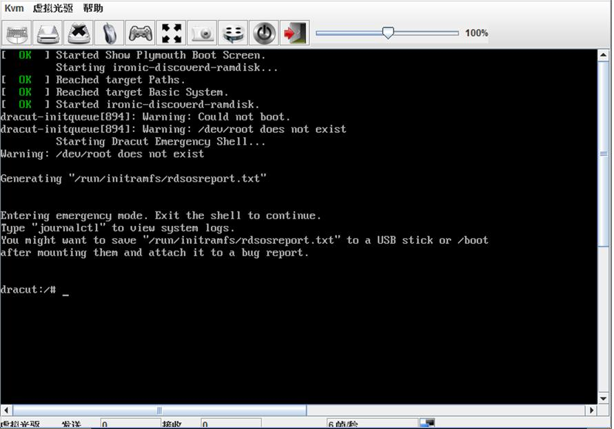

回到daisy页面进行发现主机，正常即可正常显示PXE发现的主机列表。

注意：如果10分钟内没有发现主机，需要检查PXE网络是否正确。
PXE网络的几种组网说明（需要补充相关组网图和文字）
被安装的目标主机使用的PXE口如果使用VLAN隔离，需要使用native方式。
1、PXE口不做BOND的情况
2、PXE口做BOND的情况
一个主机只允许一个网口加入PXE所在的VLAN，此网络的报文不带VLAN，使用的是native网络
3、同一机框内有多个PXE服务器的情况。

#####4.3.1.3 添加主机

发现成功之后选中所有主机，按下一步会自动将主机加入到集群中，并进入分配角色页面。

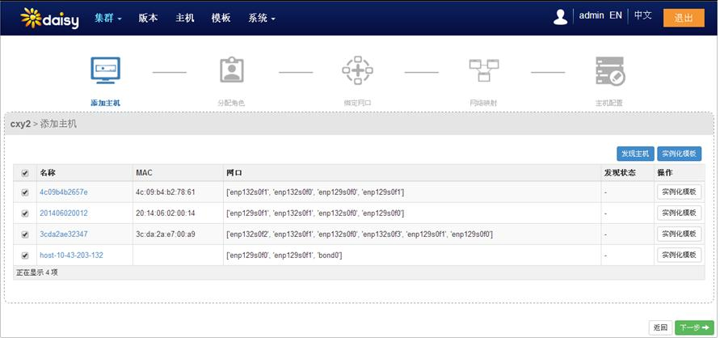

#####4.3.1.4磁阵配置

> 详见附件2  KS3200 IPSAN磁阵配置daiy安装指导.md

####4.3.2分配角色

Daisy的主机角色包括如下3种：

|名称	|描述	|中文描述|
|----|:----|:----|
|CONTROLLER_LB|	Controller role，backup type is loadbalance|	控制角色，备份方式为LB|
|CONTROLLER_HA|	Controller role，backup type is HA，active/standby	|控制角色，备份方式为HA|
|COMPUTER|	Compute role|	计算角色|

一个主机可以承载一种角色，也可以承载多个角色，角色的配置，最终影响被部署主机安装哪些TECS组件服务。角色和TECS组件的对应关系Daisy已默认定义。如不更改用户不需要关心。

对于控制节点可以有HA/LB两中组合的角色分配方式，HA的方式为控制节点必选角色，LB为控制节点可选角色，作为控制节点的主机同时也可以拥有COMPUTE角色，以同时具备计算节点的功能。控制节点最少要有两个主机节点，且角色一致。对于计算节点只有COMPUTE这一种角色。

根据组网规划，当前4个节点的角色规划为：两个控制节点（HA+LB） +两个计算节点（COMPUTER ）,通过拖拽的方式给每个物理主机分配角色。

分配完角色之后即可按下一步进行绑定网口。

####4.3.3绑定网口

主机角色分配完成之后，点击下一步，即可进行绑定网口操作。

选中某个你要绑定网卡的主机，点击右上角的绑定网口按钮，按照自己的需要进行物理网口的绑定。

根据前面组网规划，选择enp132s0f0, enp132s0f1做linux绑定，绑定口名称为bond0，绑定模式为active-backup。

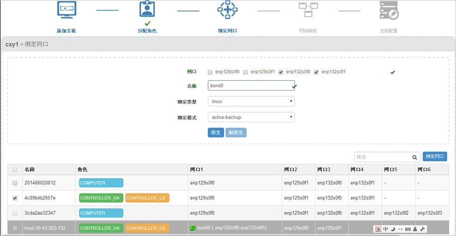

按绑定后，即可显示绑定成功；再选择其他主机，分别做绑定。

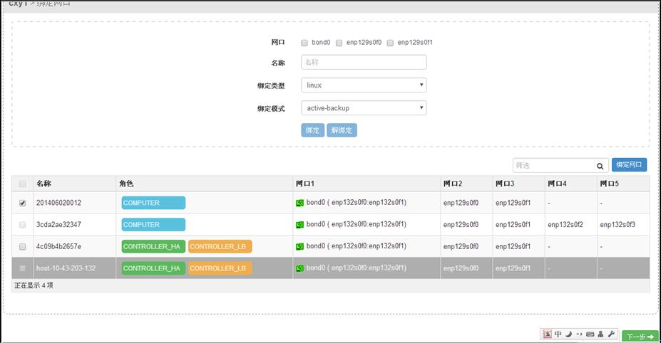

####4.3.4网络映射

绑定完网卡后，点击下一步，进入网络映射配置页面，在这里需要将物理主机的物理网卡（或者绑定后的网卡）对应到之前在集群里面配置的网络平面。

注意：对于管理面以及存储面相关地址的分配规则目前是，按照完成网络映射配置的顺序从地址池地址中从小到大顺序分配，因此需要按照刀片的槽位顺序从小到底，逐个设置网络映射。

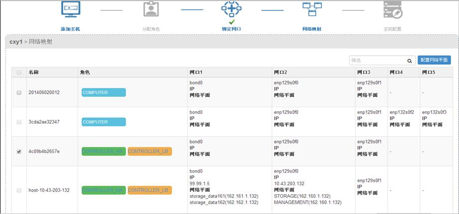

选中其中一个主机，点击【配置网络平面】

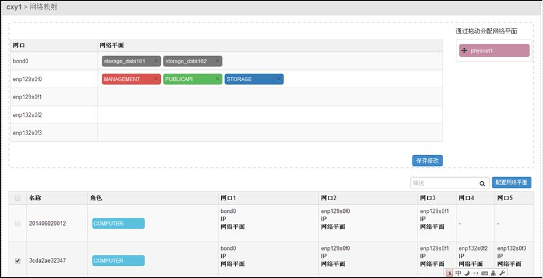

对于计算节点还需要配置physnet1 网络，需要选择虚拟交换机类型，本组网中使用OVS网络。

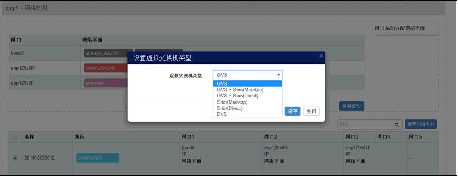

依次分配好所有主机的网络平面并保存修改

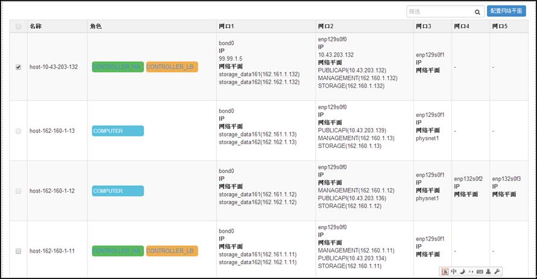

####4.3.5主机配置

网络映射配置完成之后，点击下一步开始主机配置。

选择一个主机，点击【主机配置】，即可进行配置

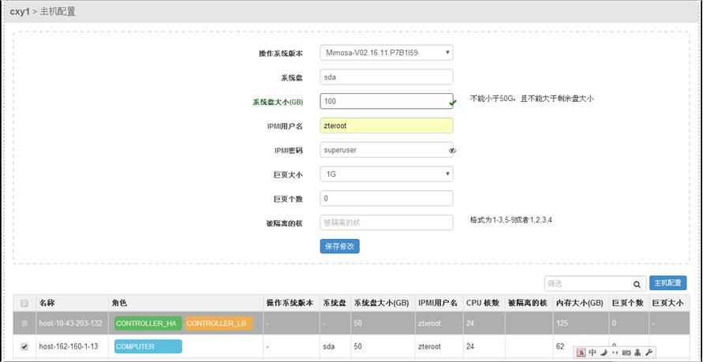

配置参数

	操作系统版本：点击下拉框选择之前上传的OS版本

	系统盘：正常情况下填写sda

	系统盘大小：默认50G，建议根据服务器的实际硬盘大小填写，此分配100G。

	IPMI User和Password：物理主机的IPMI的用户和密码，E9000刀片默认设置为zteroot/superuser

可以在7槽的daisy服务器上，通过命令对各刀片的IPMI用户进行验证。

在主机---主机列表页面可以查询到各个服务器的IPMI地址，然后用如下命令进行验证。

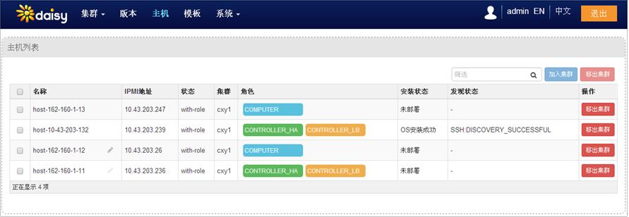

 [root@host-10-43-203-132 /(daisy_admin)]$ ipmitool -I lanplus -H 10.43.203.26 -U zteroot -P superuser  chassis power status

Chassis Power is on

[root@host-10-43-203-132 /(daisy_admin)]$ ipmitool -I lanplus -H 10.43.203.236 -U zteroot -P superuser  chassis power status

Chassis Power is on

[root@host-10-43-203-132 /(daisy_admin)]$ ipmitool -I lanplus -H 10.43.203.247 -U zteroot -P superuser  chassis power status

Chassis Power is on

验证成功，就可以通过ipmi，设置刀片从PXE或disk方式启动，并自动安装系统。

	巨页大小：在physnet1网络使用DVS交换时需要配置巨页参数，默认1G，这个参数只在角色为计算节点的主机配置。

	巨页个数：在physnet1网络使用DVS交换时需要配置巨页参数, 这个参数只在角色为计算节点的主机配置，规划要求为128G内存设置108，64G内存设置44；此处因为使用的是OVS网络，所以可以不配置。 

	被隔离的核：在physnet1网络使用DVS交换时需要配置巨页参数, 这个参数只在角色为计算节点的主机配置。

所有主机配置完成之后即可按【部署】进行自动部署

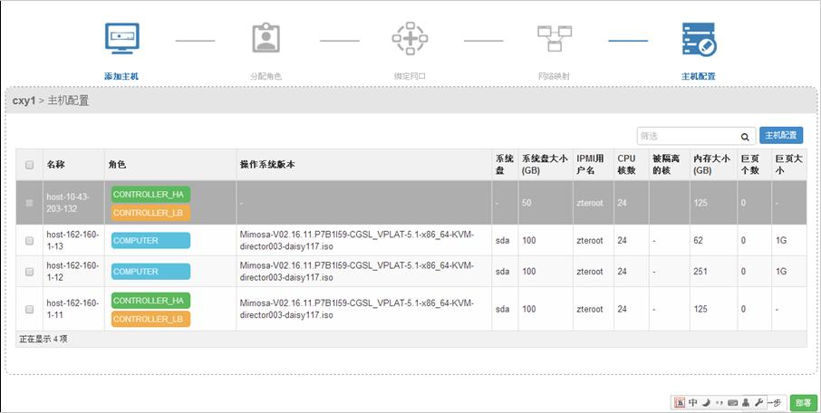

####4.3.6部署

按部署按钮之后，自动跳转到集群部署信息页面通过进度条提示可以实时显示整个部署进程。安装过程中先安装OS再安装TECS版本。

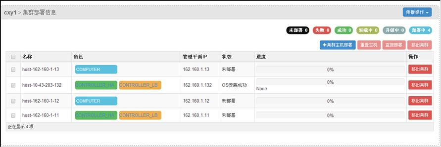

OS安装成功之后开始安装TECS版本

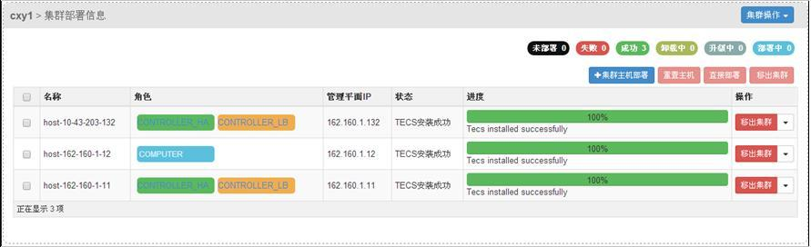

状态中显示TECS安装成功，进度为100%时表示TECS安装成功。

##5 Daisy WEB界面介绍

###5.1	集群

####5.1.1	我的集群列表

####5.1.2	创建集群

#####5.1.2.1	基本信息

#####5.1.2.2	角色配置

#####5.1.2.3	网络平面配置

####5.1.3集群部署信息

#####5.1.3.1	集群主机部署

######5.1.3.1.1	添加主机

1. SSH发现

2. PXE发现

3. 添加主机

######5.1.3.1.2	分配角色

######5.1.3.1.3	绑定网口

######5.1.3.1.4	网络映射

######5.1.3.1.5	主机配置

#####5.1.3.2	重置主机

除宿主机之外，所有其他主机均可进行重置主机；

选择一台主机，然后点击重置主机，主机重置之后可以操作系统可以重新进行安装OS。

#####5.1.3.3	直接部署

直接部署可以将主机的系统进行重新安装的操作

#####5.1.3.4	移出集群

移出集群可以将主机从当前集群移出，此时这台主机将重新进入主机发现列表，需要进行重新配置，加入其他集群。

#####5.1.3.5	生成主机模板

####5.1.4	集群操作

#####5.1.4.1 修改集群

#####5.1.4.2 升级集群
Daisy支持已安装的集群的升级功能。在升级前，需要将升级包上传到/var/lib/daisy/tecs/(特别说明，该目录下只能存放一份最新的TFG和TECS的bin包)，可以通过5.1节实现web页面上传版本。上传的版本会自动替换固定目录下的原有版本。
  登录web，进入集群页面，鼠标移动到待升级的集群，会显示一些图标，点击向上箭头的图标，会跳出确认对话框，点击“确认”，即自动跳转至集群进度界面，显示升级进度。

#####5.1.4.3 卸载TECS
Daisy支持已安装的集群在部署后，卸载集群中的刀片的tecs软件。进入集群页面，鼠标移动到待卸载的集群，会显示一些图标，点击向下箭头的图标，会跳出确认对话框，点击“确认”，即自动跳转至集群进度界面，显示卸载进度。

#####5.1.4.4	生成集群模板

###5.2	版本

####5.2.1	上传OS和TECS版本

上传OS和TECS版本有两种方式：一种是通过docker将版本上传到daisy服务器的/var/lib/daisy/tecs目录，一种是从dashboard上传。

1、通过docker上传版本

拷贝版本到第一台服务器（daisy的宿主机）/home/目录下。

执行命令：docker cp  Mimosa-V02.16.10.P6B1I32-CGSL_VPLAT-5.1-x86_64-KVM.iso daisy:/var/lib/daisy/tecs

执行命令：docker cp  ZXTECS_V02.16.10_P6B1_I151_installtecs_el7_noarch.bin daisy:/var/lib/daisy/tecs

2、通过dashboard上传

进入web界面后，点击左上角版本，点击浏览，选择需要上传的OS和TECS版本，这里上传的OS版本为：Mimosa-V02.16.10.P6B1I22-CGSL_VPLAT-5.1-x86_64-KVM.iso，上传的TECS版本为ZXTECS_V02.16.10_P6B1_I102_installtecs_el7_noarch.bin，上传后，可以在版本页面看到上传后的版本文件。

###5.3	主机

####5.3.1	主机列表

####5.3.2	加入集群

####5.3.3	移出集群

###5.4	模板

###5.5	系统

####5.5.1	备份和恢复

#####5.5.1.1	备份

#####5.5.1.2	恢复

####5.5.2	系统配置

##6 daisy安装升级卸载操作指导

##7	附件

###7.1	附件1  U盘的制作

###7.3	附件2  KS3200 IPSAN磁阵配置

